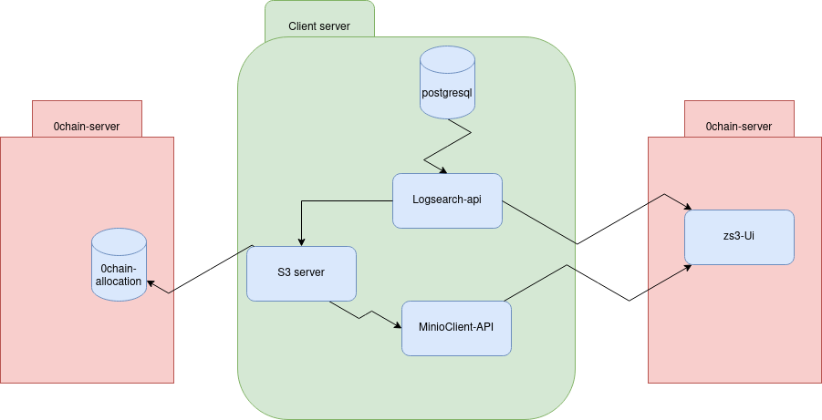

# Minio ClientAPI


This is the only component that can communicate with ZS2server and it is protected using the API key and API secret Key. 

It will be used also by the UI component to do al the required function like creating a bucket, deleting a bucket and putting an object, etc ....

If you are running the components using ``docker-compose`` the client API will be running on port ``3001`` so to access it from your local you can visit ``localhost:3001``

This component is also based on the minio Client SDK you can find it [here](https://github.com/minio/minio-go)

# How to use it?

There is a couple of function that has been already implemented but we can add more.

1. CreateBucket
2. listBuckets
3. listbucketsObjest
4. listObjects
5. getObject
6. putObject
7. deleteObject

There are two query parameters are needed for any api call

* AccessKey: same as the Zs3server root username
* SecretAccessKey: same as the Zs3server root password
## CreateBucket

This function will create a bucket for you and this bucket will be stored in 0chain allocation, it should be unique name

Example

```shell
curl -X GET -i 'http://localhost:3001/?action=createBucket&bucketName=${bucketname}'
```
Param:

* Action: "createBucket"
* bucketName: is the desired bucket name should be unique

Output:

```
{
  "Success": true,
  "Bucketname": "createdBucketName"
}
```

## listBuckets

This function to list all the avaliable buckets

Example:

```shell
curl -X GET -i 'http://localhost:3001/?action=listBuckets'
```

Param:

* ``action`` : "listBuckets"

Output:
* Array of buckets 

Example:

```
[
  {
    "BucketName": "root",
    "CreationDate": "2022-11-15T14:14:31Z"
  },
  {
    "BucketName": "test-zidan",
    "CreationDate": "2022-11-15T14:14:31Z"
  },
  {
    "BucketName": "test-zidan2",
    "CreationDate": "2022-11-17T07:57:17Z"
  }
]
```

## listbucketsObjest

This function will list all the bucket with it's objects


Example:

```shell
curl -X GET -i 'http://localhost:3001/?action=listBucketsObjects'
```

Param:

* ``action`` : "listBucketsObjects"

Output:

* array of buckets of objects

Example:
```
[
  {
    "BucketName": "test-zidan",
    "CreationTime": "2022-11-15T14:14:31Z",
    "BucketObjects": [
      {
        "Name": "OLXOTQAI.pdf",
        "LastModified": "2022-11-16T01:07:47Z"
      }
    ]
  },
  {
    "BucketName": "test-zidan2",
    "CreationTime": "2022-11-17T07:57:17Z",
    "BucketObjects": []
  }
]
```


## listObjects

This function will list all the objects for specific bucket

Example 

```shell
curl -X GET -i 'http://localhost:3001/?action=listObjects&bucketName=mybucketname'
```

Param:

* ``action`` : "listObjects"
* ``bucketName``: the bucket name that you want to list its objects

Output:

* Array of Objects

Example
```
[
  {
    "Name": "OLXOTQAI.pdf",
    "LastModified": "2022-11-16T01:07:47Z"
  }
]
```

## getObject

Returns a stream of the object data, this will be used to store the image then the user will be able to download it. 

Example 

```shell
curl -X GET -i 'http://localhost:3001/?action=getObject&bucketName=mybucketname&objectName=myobject'
```

Param:

* ``action`` : "getObject"
* ``bucketName``: the bucket name that you want to list its objects
* ``objectName``: the object name that you want to download it.

Output:

* Binary file will downloaded.

## putObject

This function is to upload object to zs3server 

Example:

```shell 
curl -X GET -i 'http://localhost:3001/?action=putObject&bucketName=mybucketname'

File: from form
```

Param:

* ``action`` : "putObject"
* ``bucketName``: the bucket name that you want to list its objects

Form:

* this API require a form filed with name ``file`` so it can upload this file to zs3server 

## removeObject

this API is to remove an object from zs3server


```shell 
curl -X GET -i 'http://localhost:3001/?action=removeObject&bucketName=mybucketname&objectName=${objectname}'

```

Param:

* ``action`` : "removeObject"
* ``bucketName``: the bucket name that you want to list its objects
* ``objectName``: the object name that you want to remove it.

Output:

```
{
  "Success": true,
  "ObjectName": "ObjectName"
}
```
